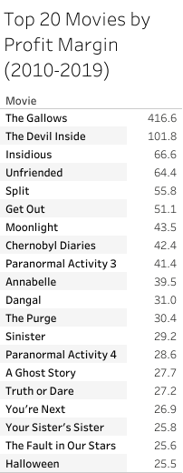
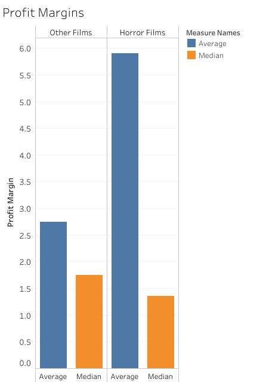
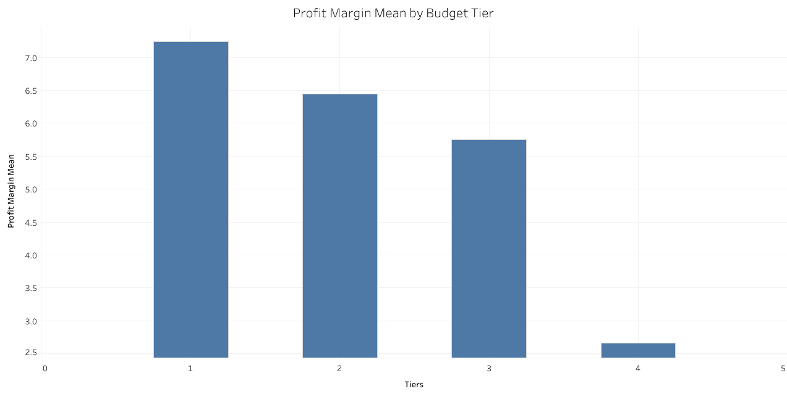
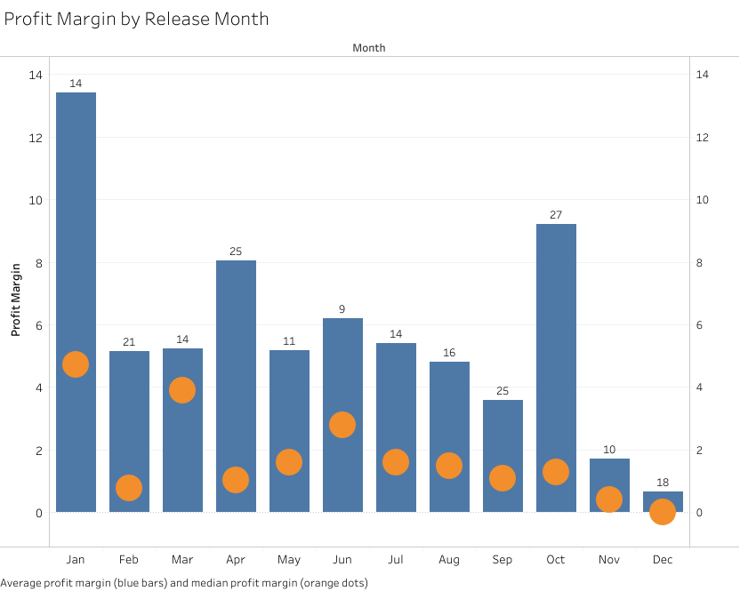

# Box Office Film Analysis

**Authors**: Lydia Cuffman, Em Jager & JF Roberts

<p align="center">
  
</p>

## Overview

Our data analytics firm has been hired by Flatiron Productions to analyze which films perform the best at the Box Office. This project analyses a data set that combines data from [IMBd](https://www.imdb.com/)
 and [The Numbers](https://www.the-numbers.com/movie/) to assess which movies have the most success worldwide. Based on our analysis results, we will make recommendations based on genre, production budget, and seasonal trends.

## Business Understanding

Flatiron Productions wants to invest in a new film studio. Having no experience in the film industry, the company has hired our data analytics firm to explore what makes for a successful film and to make recommendations on a low-risk investment strategy to break into the film industry. Our analysis will allow Flatiron Productions to create a new film studio with a clear understanding of what type of movies to produce, what production budget tier they should focus on, and when to release them.

## The Data 

<p align="center">
  
</p>

The data we used for our analysis combined two data sets. The first data set was pulled from IMDb and includes movie information and ratings from 1915 to 2019. The second data set we used was pulled from "The Numbers"; it includes information about budgets and gross revenues for each movie. Our merged working data set will focus on movie genre, production budget, month of release, and an engineered profit ratio.

## Key Statistics & Analysis

We engineered a "Profit Ratio" variable to allow for more meaningful business analysis and comparison between different movies. We filtered our data set to include only movies released between 2010 and 2019 (2019 being the most recent release date in the original data set). This was to account for the rise of streaming services in the late 2000s that completely changed how the public released and consumed movies.


## Conclusion - 3 Recommendations 

1. **Produce Horror Movies** - Based on our in-depth analysis, we recommend producing horror movies compared to other genres as they provide the highest profit ratio of all movie genres on average.




2. **Focus on Low-Budget Horror Movies** - Taking it a step further, we recommend producing low-budget horror movies as they return higher profit ratios, on average, than high-budget horror movies. In doing so, you would both minimize your investment risk and lower your initial investment, reducing your barrier to entry to the film industry.





3. **Month of release should not be a primary focus** - Though there seems to be a difference, according to our visuals, that month of release affects the profit ratio for a horror movie; there actually is no statistically significant difference between months. This leads us to our 'Next Steps' in our analysis...



## Next Steps

1. We would like to pull data on more movies to increase our sample sizes to better analyze the month of release. 

2. Because our data only went through 2019, we want to gather data from 2020-2023 to see the recovery of the film industry post-pandemic. We would also analyze if the habits of people going to the movies have changed since then - did people get used to streaming, or is the film industry back and better than ever?

3. Lastly, we want to take a more granular look into the time of year for movie releases to see if there are specific events, such as film festivals or holidays like Halloween, that might be really exceptional times to release horror movies. These factors may have a more significant impact on a movie's success and profits than the month they are generally released in. 


## Repository Structure

```
├── images
├── working_notebooks
├── zippedData
├── README.md
├── .gitignore
└── Data_Analysis.ipynb
```
